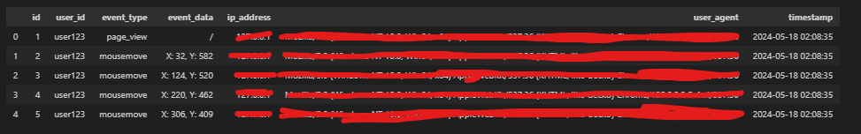

[](https://opensource.org/licenses/MIT)

# user_data_tracking_demo

Data is the life-giving bloodline for Machine learning and artificial intelligence, so it is critical to know how to start collecting data, one way or another.

Ever wonder how apps, websites, games, etc try to capture user data? Well here is an example of some data that can be captured when you visit a website or blog etc. Understanding this will also allow you to evade banning.

## Prequisites
1. install a virtual environment and install the libraries in the requirements.txt
    ```
    conda create -n venv python=3.12
    ```
    - alternative method is to create a docker image/container
    - this is best practice in order to isolate and reproduce development environment without distrupting the rest of your development environment  

## Results

As we can see, if you were to create a website, simply using the flask framework, you are able to collect a multitude of user interaction data. The below table is actual data collected during a test run.


### Data Dictionary - metadata information for the columns/data being captured and placed into database
- id = the event id as it occurs
- user_id = the user id of the individual who visited your site
- event_type = the activity that the user carried out on the webpage
- event_data = where on the website or on the screen did this event occur
- ip_address = the ip_address associated with the user
- user_agent = the computer/browser and other agent information the user was operating on while they were on your website/webpage carrying out all these activities
- timestamp = the exact moment in time where this data was captured
